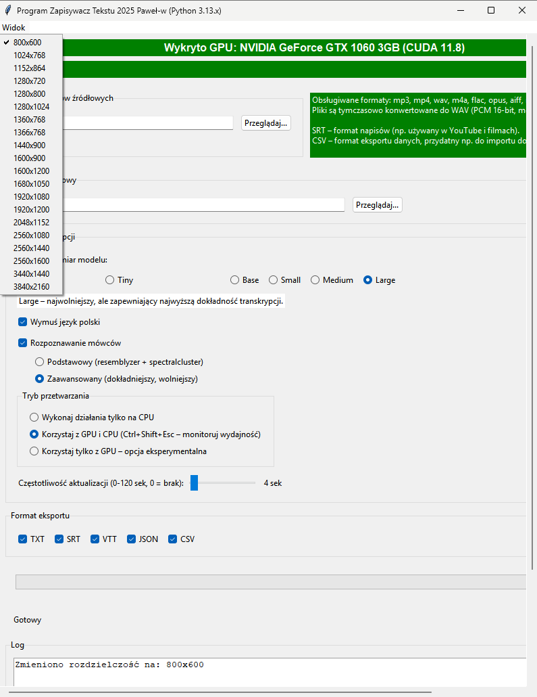
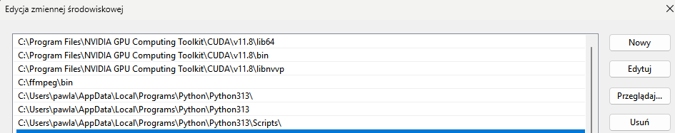
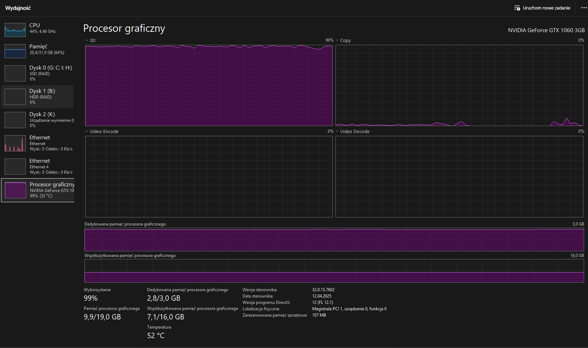
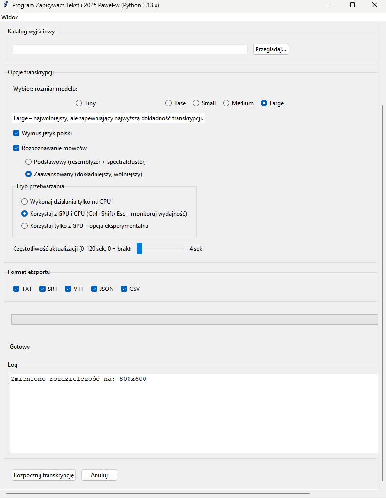

<<<<<<< HEAD
# TranskrypcjaTeksuZAudio
Zapisywacz Tekstu 2025 to aaplikacja do automatycznej transkrypcji plików audio i wideo, oparta na technologii sztucznej inteligencji. Program obsługuje szeroki zakres formatów multimedialnych i umożliwia zapis wyników transkrypcji w różnych formatach: TXT, SRT, VTT, JSON, CSV. 
=======
# Program Zapisywacz Tekstu 2025

> **Uwaga:** Program został stworzony z pomocą Chata AI Capilot oraz Claude.

## Opis
**Program Zapisywacz Tekstu 2025** to aplikacja stworzona w języku Python, służąca do automatycznej transkrypcji plików audio i wideo na tekst. Program wykorzystuje model Whisper do rozpoznawania mowy oraz zawiera funkcję rozpoznawania mówców (diaryzacji). Aplikacja jest dostępna wyłącznie w języku polskim.



### Główne funkcje:
- Transkrypcja plików audio i wideo na tekst
- Obsługa wielu formatów plików: mp3, mp4, wav, m4a, flac, opus, aiff, mov, avi, mkv
- Rozpoznawanie mówców (diaryzacja)
- Eksport wyników w różnych formatach: TXT, SRT, VTT, JSON, CSV
- Możliwość wyboru rozmiaru modelu Whisper (tiny, base, small, medium, large)
- Wsparcie dla przetwarzania na CPU lub GPU (NVIDIA z CUDA)

## Wymagania systemowe
- Python 3.13.x (program działa TYLKO z tą wersją Pythona)
- CUDA 11.8 (program działa TYLKO z tą wersją CUDA)
- Biblioteki: torch, whisper, moviepy, pydub, resemblyzer, spectralcluster, numpy, soundfile, librosa
- Dla pełnej wydajności: karta graficzna NVIDIA wspierająca CUDA 11.8 oraz min. 3GB VRAM

> **WAŻNE:** Program został przetestowany na karcie graficznej NVIDIA GeForce GTX 1060 3GB z obsługą CUDA.

### Zmienne środowiskowe CUDA
Upewnij się, że zmienne środowiskowe CUDA są prawidłowo skonfigurowane w systemie:

```
CUDA_HOME=C:\Program Files\NVIDIA GPU Computing Toolkit\CUDA\v11.8
PATH=%PATH%;%CUDA_HOME%\bin
```



## Instalacja

### 1. Pobierz i zainstaluj CUDA 11.8
Pobierz CUDA 11.8 ze strony NVIDIA: [https://developer.nvidia.com/cuda-11-8-0-download-archive?target_os=Windows&target_arch=x86_64&target_version=11&target_type=exe_local](https://developer.nvidia.com/cuda-11-8-0-download-archive?target_os=Windows&target_arch=x86_64&target_version=11&target_type=exe_local)

### 2. Sklonuj repozytorium:
```
git clone https://github.com/legionowopawel/TranskrypcjaTeksuZAudio.git
```

### 3. Zainstaluj wymagane biblioteki:
```
python -m pip install --upgrade pip
pip install -r requirements.txt
pip check
```

## Wydajność programu

Program został przetestowany na następującej konfiguracji:
- Procesor: Intel i7
- RAM: 32GB
- Karta graficzna: NVIDIA GeForce GTX 1060 3GB
- Ustawienia: model 'large', tryb 'cpu+gpu'

Wyniki testu:
- Czas trwania nagrania testowego: 1 minuta 3 sekundy
- Czas przetwarzania: 4 minuty 40 sekund



Na podstawie tych wyników, wydajność programu wynosi około 12.9 minut przetworzonego materiału na godzinę pracy komputera. Oznacza to, że przetworzenie 1 godziny nagrania zajmie około 4 godzin 39 minut.

> **Ostrzeżenie:** W przypadku starszych komputerów zaleca się włączenie wentylatorów CPU na maksymalną prędkość (np. poprzez Smart Fan 5) w celu uniknięcia przegrzania.

## Instrukcja użytkowania

### Uruchomienie programu
```
python main.py
```

### Krok po kroku:
1. **Wybór plików**:
   - Kliknij przycisk "Przeglądaj..." w sekcji "Wybór plików źródłowych"
   - Wybierz jeden lub więcej plików audio/wideo do transkrypcji

2. **Katalog wyjściowy**:
   - Domyślnie jest to katalog, z którego wybrano pliki
   - Możesz zmienić katalog wyjściowy klikając "Przeglądaj..." w sekcji "Katalog wyjściowy"

3. **Opcje transkrypcji**:
   - Wybierz rozmiar modelu (tiny, base, small, medium, large)
   - Zdecyduj czy wymusić język polski
   - Włącz lub wyłącz rozpoznawanie mówców
   - Wybierz metodę diaryzacji (podstawowa lub zaawansowana)
   - Wybierz tryb przetwarzania (CPU, GPU+CPU, tylko GPU)
   - Ustaw częstotliwość aktualizacji informacji o postępie

4. **Format eksportu**:
   - Zaznacz formaty, w których chcesz otrzymać wyniki (TXT, SRT, VTT, JSON, CSV)

5. **Rozpocznij transkrypcję**:
   - Kliknij przycisk "Rozpocznij transkrypcję"
   - Postęp będzie widoczny na pasku postępu oraz w polu logów
   - Po zakończeniu usłyszysz sygnał dźwiękowy



### Wyniki
Wyniki transkrypcji są zapisywane w katalogu `wyniki_<nazwa_pliku>` w miejscu wskazanym jako katalog wyjściowy. Pliki tymczasowe są przechowywane w katalogu `Tymczasowy_<nazwa_pliku>`. Logi są zapisywane w folderze `logs`.

## Rozwiązywanie problemów

### Problemy z wyświetlaniem
W przypadku problemów z wyświetlaniem interfejsu:
1. Naciśnij "Widok" w górnym menu
2. Wybierz rozdzielczość 800x600
3. Używaj paska przewijania po prawej stronie do nawigacji (przewijanie myszką może nie działać)

## Pliki testowe

W katalogu `test` znajduje się przykładowy plik `Pierwsze_slowa_Jana_Pawla_II_do_Rodakow.mp3`, który został przetworzony przez program. Katalog zawiera również wyniki transkrypcji w różnych formatach oraz pliki tymczasowe i logi.

Struktura katalogu testowego:
```
test/
├── Pierwsze_slowa_Jana_Pawla_II_do_Rodakow.mp3
├── logs/
│   └── Pierwsze_slowa_Jana_Pawla_II_do_Rodakow.log
├── Tymczasowy_Pierwsze_slowa_Jana_Pawla_II_do_Rodakow/
│   └── processed_audio.wav
└── wyniki_Pierwsze_slowa_Jana_Pawla_II_do_Rodakow/
    ├── Pierwsze_slowa_Jana_Pawla_II_do_Rodakow.csv
    ├── Pierwsze_slowa_Jana_Pawla_II_do_Rodakow.json
    ├── Pierwsze_slowa_Jana_Pawla_II_do_Rodakow.srt
    ├── Pierwsze_slowa_Jana_Pawla_II_do_Rodakow.txt
    ├── Pierwsze_slowa_Jana_Pawla_II_do_Rodakow.vtt
    └── Pierwsze_slowa_Jana_Pawla_II_do_Rodakow_autorski.txt
```

